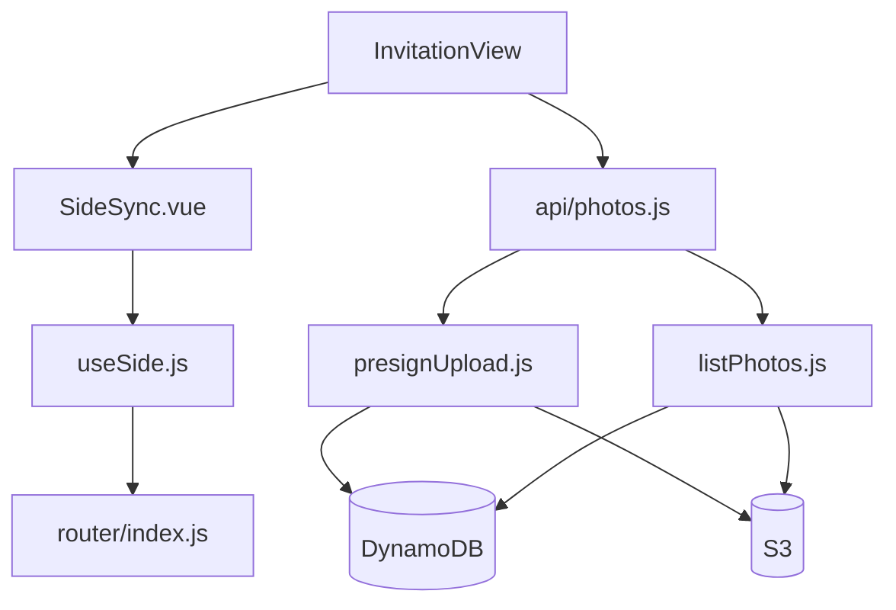

# 모바일 청첩장 모노레포 초기 설정 계획

## 현재 상태

- 워크스페이스: Git만 초기화됨 (remote: `EllieChoi1998/mobile-wedding-invitation`, 커밋 없음)
- 애플리케이션 코드 없음 — **전체 스캐폴딩** 대상
- 기본 선택: **JavaScript** + **AWS SAM** (질문 스킵 시 합리적 기본값)

## 목표 아키텍처

src/mermaid
flowchart LR
  subgraph vercel [Vercel]
    FE[Vue3_Frontend]
  end
  subgraph aws [AWS]
    APIGW[API_Gateway]
    Lambda[Lambda_Handlers]
    DDB[(DynamoDB)]
    S3[(S3_Bucket)]
  end
  FE -->|"GET ?side=groom"| FE
  FE -->|"POST /photos/presign"| APIGW
  FE -->|"PUT image"| S3
  FE -->|"GET /photos?side="| APIGW
  APIGW --> Lambda
  Lambda --> DDB
  Lambda --> S3
```

**Presigned URL 업로드 흐름**

1. 프론트 → `POST /photos/presign` (side, fileName, contentType)
2. Lambda → S3 Presigned PUT URL 발급 + DynamoDB 메타데이터 레코드 생성
3. 프론트 → S3에 직접 PUT 업로드
4. 프론트 → `GET /photos?side=groom` 으로 갤러리 조회

---

## 1. 모노레포 폴더 구조

```
mobile-wedding-invitation/
├── .gitignore
├── .github/
│   └── workflows/
│       └── deploy-backend.yml
├── frontend/
│   ├── package.json
│   ├── vite.config.js
│   ├── vercel.json
│   ├── index.html
│   ├── .env.example
│   └── src/
│       ├── main.js
│       ├── App.vue
│       ├── router/index.js
│       ├── composables/useSide.js
│       ├── components/SideSync.vue
│       ├── views/InvitationView.vue
│       ├── api/photos.js
│       └── data/invitation.js
└── backend/
    ├── package.json
    ├── template.yaml
    ├── samconfig.toml.example
    ├── .env.example
    └── src/
        └── handlers/
            ├── presignUpload.js
            └── listPhotos.js
```

루트 `package.json`은 요청 범위 외이므로 생성하지 않음.

---

## 2. 루트 [.gitignore](.gitignore)

- `node_modules/`, `dist/`, `.vercel/`
- `.env`, `.env.*` (`.env.example`은 허용)
- AWS SAM: `.aws-sam/`
- OS/IDE: `.DS_Store`

---

## 3. Frontend — Vue 3 + Vite + Vercel

### 생성

[`frontend/`](frontend/) 에 Vite Vue 템플릿 + `vue-router` 설치.

### [frontend/vite.config.js](frontend/vite.config.js)

- `base: '/'`
- dev 프록시: `/api` → 로컬 SAM (`http://127.0.0.1:3000`)

### [frontend/vercel.json](frontend/vercel.json)

```json
{
  "buildCommand": "npm run build",
  "outputDirectory": "dist",
  "framework": "vite",
  "rewrites": [{ "source": "/(.*)", "destination": "/index.html" }]
}
```

Vercel 대시보드에서 **Root Directory = `frontend`** 설정 필요.

### [frontend/.env.example](frontend/.env.example)

```
VITE_API_BASE_URL=https://your-api-id.execute-api.ap-northeast-2.amazonaws.com/prod
```

### Vue Router + side 파라미터

[`frontend/src/router/index.js`](frontend/src/router/index.js): 단일 라우트 `/` → `InvitationView`.

[`frontend/src/composables/useSide.js`](frontend/src/composables/useSide.js):

- `useRoute()`의 `query.side` 읽기
- `groom` / `bride`만 허용, 그 외는 `groom` 기본값
- `watch`로 URL 변경 시 reactive 동기화

[`frontend/src/data/invitation.js`](frontend/src/data/invitation.js): side별 정적 데이터 (이름, 인사말 등).

[`frontend/src/components/SideSync.vue`](frontend/src/components/SideSync.vue) — **요청 예시 컴포넌트**:

- `useSide()` 사용
- 마운트/`route.query` 변경 시 sideInfo` 동기화
- side별 다른 텍스트·테마 색상 표시
- `SideSync`를 `InvitationView`에 배치

[`frontend/src/views/InvitationView.vue`](frontend/src/views/InvitationView.vue):

- `SideSync` + 사진 업로드/갤러리 UI
- `?side=bride` / `?side=groom` 전환 시 데이터 자동 갱신

### [frontend/src/api/photos.js](frontend/src/api/photos.js)

- `requestPresignedUrl({ side, fileName, contentType })`
- `uploadToS3(uploadUrl, file, contentType)` — fetch PUT
- `listPhotos(side)`

---

## 4. Backend — AWS SAM + Lambda

### [backend/template.yaml](backend/template.yaml)

SAM 리소스:

| 리소스 | 용도 |
|--------|------|
| `PhotosTable` (DynamoDB) | 메타데이터 (PK/SK) |
| `PhotosBucket` (S3) | 이미지 저장, CORS 설정 |
| `HttpApi` (API Gateway v2) | REST 엔드포인트 |
| `PresignFunction` | Presigned URL 발급 |
| `ListPhotosFunction` | side별 사진 목록 |

**DynamoDB 단일 테이블 (심플 모델)**

| PK | SK | 속성 |
|----|-----|------|
| `SIDE#groom` | `PHOTO#{isoTime}#{uuid}` | s3Key, fileName, contentType, uploadedAt |

조회: `PK = SIDE#{side}`, SK begins_with `PHOTO#`

**API 엔드포인트**

- `POST /photos/presign` — body: `{ side, fileName, contentType }` → `{ uploadUrl, photoId, s3Key }`
- `GET /photos?side=groom` → `{ photos: [{ photoId, s3Key, fileName, uploadedAt, viewUrl }] }`

`viewUrl`은 Lambda에서 S3 Presigned GET URL 생성 (또는 CloudFront 연동 전 임시 방안).

**S3 CORS**: Vercel 도메인 + `localhost:5173` 허용 (PUT/GET).

**Lambda IAM**: DynamoDB PutItem/Query, S3 PutObject/GetObject.

### 핸들러

[`backend/src/handlers/presignUpload.js`](backend/src/handlers/presignUpload.js):

- side 검증 (`groom`|`bride`)
- UUID + S3 key 생성 (`photos/{side}/{uuid}-{fileName}`)
- `@aws-sdk/client-s3` `getSignedUrl` (PutObject, 5분 TTL)
- DynamoDB PutItem

[`backend/src/handlers/listPhotos.js`](backend/src/handlers/listPhotos.js):

- Query by PK
- 각 항목에 Presigned GET URL 첨부

[`backend/package.json`](backend/package.json): `@aws-sdk/client-s3`, `@aws-sdk/client-dynamodb`, `@aws-sdk/lib-dynamodb`, `@aws-sdk/s3-request-presigner`.

[`backend/samconfig.toml.example`](backend/samconfig.toml.example): stack 이름, region(`ap-northeast-2`), S3 배포 버킷 placeholder.

---

## 5. CI/CD — [.github/workflows/deploy-backend.yml](.github/workflows/deploy-backend.yml)

**트리거**: `main` push, `backend/**` 경로 변경 시

**단계**:

1. checkout
2. setup Node.js
3. `sam build` + `sam deploy --no-confirm-changeset --no-fail-on-empty-changeset`
4. GitHub Secrets: `AWS_ACCESS_KEY_ID`, `AWS_SECRET_ACCESS_KEY`, `AWS_REGION`

**프론트엔드**: Vercel GitHub 연동으로 `frontend/` 자동 배포 (별도 workflow 불필요). 배포 후 Vercel 환경변수에 `VITE_API_BASE_URL` 설정.

---

## 6. 로컬 개발 순서

```bash
# Backend
cd backend && npm install
sam build && sam local start-api   # http://127.0.0.1:3000

# Frontend (별도 터미널)
cd frontend && npm install
cp .env.example .env.local         # VITE_API_BASE_URL=/api
npm run dev                        # http://localhost:5173
```

테스트 URL:

- `http://localhost:5173/?side=groom`
- `http://localhost:5173/?side=bride`

---

## 7. 구현 후 수동 설정 (코드 외)

| 항목 | 작업 |
|------|------|
| AWS | IAM 사용자/역할, SAM 최초 deploy |
| GitHub Secrets | AWS 자격증명 |
| Vercel | Repo 연결, Root=`frontend`, env var |
| S3 CORS | Vercel 프로덕션 URL 반영 |

---

## 주요 파일 관계


